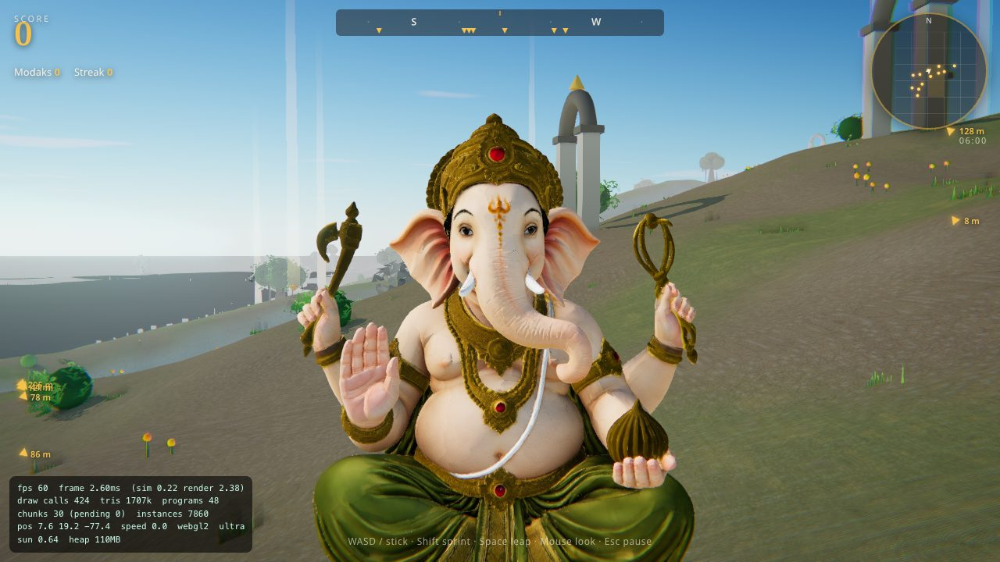
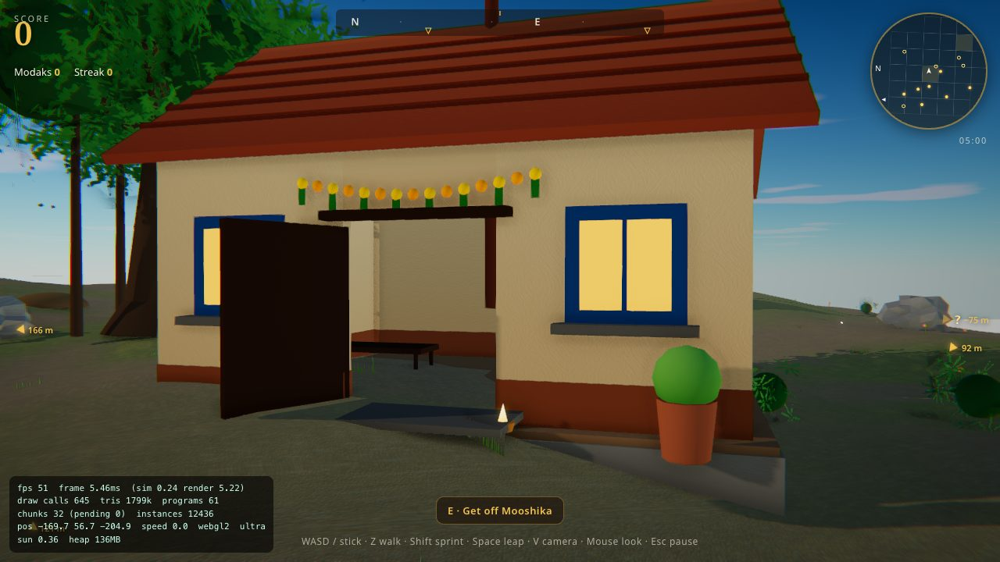
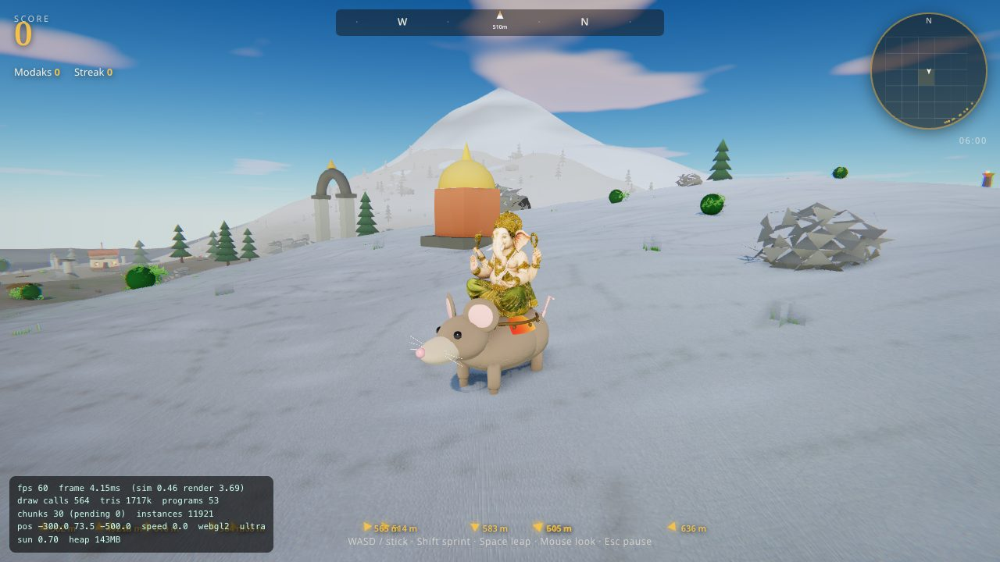
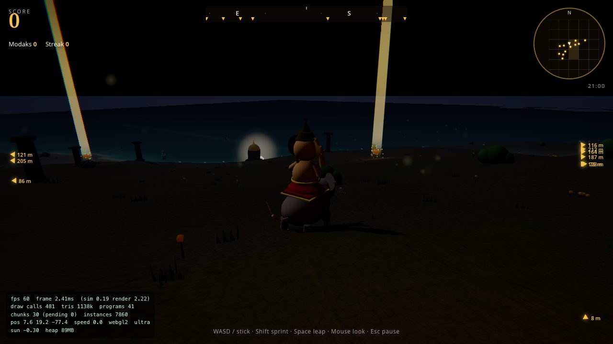
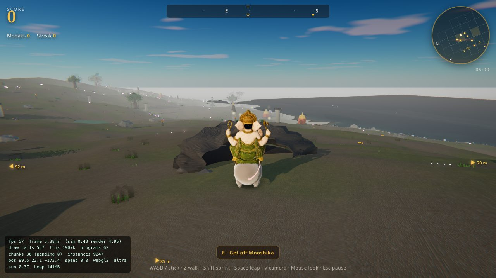
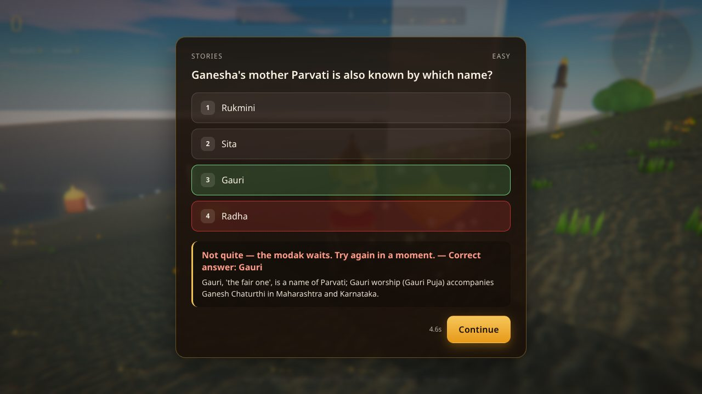
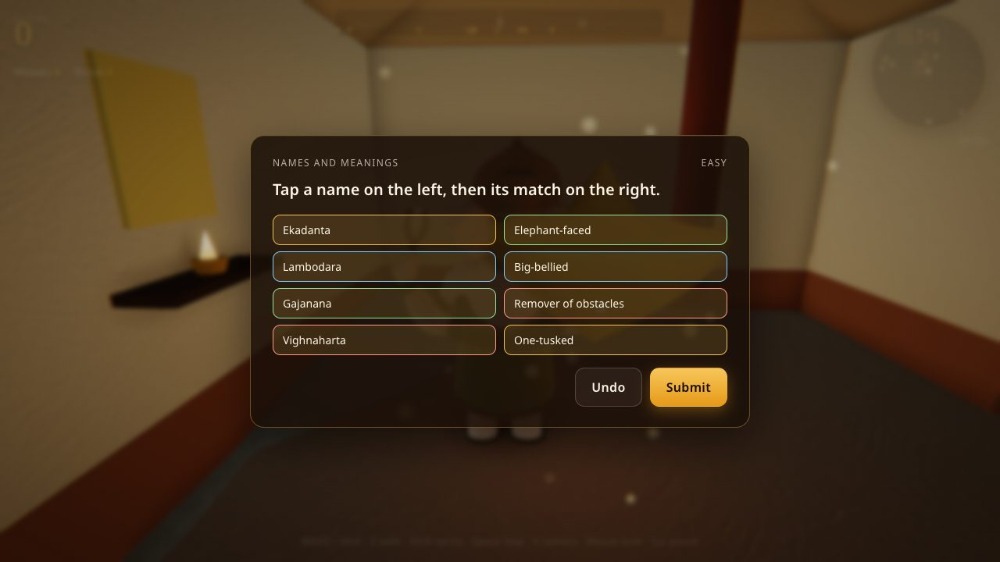
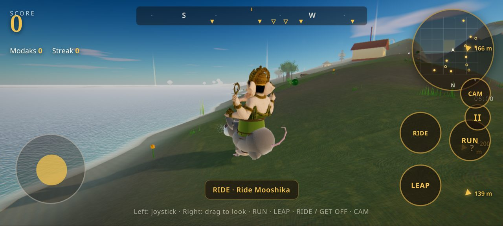

# Ganesh & Unlimited Modak

A 3D open-world collection game. Ride with Lord Ganesha on Mooshika across an
endless, procedurally generated land. Golden modaks glow in the distance —
reach one, answer a question about Ganesha, and it's yours. Every answer
teaches something real. There is no losing: a wrong answer only means
"try again".

<p align="center">
  
  
</p>
<p align="center">
  
  
</p>

## Play

- **Web:** **<https://lordganesh-ochre.vercel.app/>** — desktop or phone, no
  install. Everyone plays the same daily world and one global leaderboard.
- **Locally:**

  ```bash
  npm install
  npm run dev        # http://localhost:3003
  npm run build      # production build in dist/
  ```

Requires a browser with WebGL 2 (every current desktop and mobile browser).

## How to play

| Action | Keyboard / mouse | Gamepad | Touch |
| --- | --- | --- | --- |
| Move | WASD / arrows | Left stick | Left joystick |
| Look | Mouse (click to lock) | Right stick | Drag on the right half |
| Sprint | Shift | LS click / RT | RUN |
| Leap | Space | A | LEAP |
| Get off / ride / call Mooshika | E | Y | RIDE / GET OFF |
| Camera view | V | — | CAM |
| Pause | Esc | Start | II |
| Answer | 1–4, Enter to continue | A to continue | tap |
| Mute music | M | — | — |

- **Modaks** are marked by beams of light, edge arrows, the compass and the
  minimap. Walk into one and a question card appears. Correct: **+100** and a
  new modak spawns elsewhere. Wrong: the correct answer and a short
  explanation are shown — the teaching moment — with a 5-second cooldown.
  Streaks of 3, 5 and 10 correct answers give bonuses of 50, 150 and 500.
- **Hidden modaks** (marked **?**) sit inside houses, huts and caves. Mooshika
  cannot go indoors: press **E** to dismount and walk in on foot. Press **E**
  away from him to whistle him back.
- **Challenge types:** multiple-choice questions, fill-the-blank shlokas,
  arrange-in-order puzzles (mantras, stories, the Ashtavinayak yatra, the eight
  avatars…) and match-the-pairs sets. Missed ones are collected under
  *Modaks you missed* for review.
- **Two modes:** *Free Journey*, and **Modak Hunt** — the competitive mode with
  more modaks hidden indoors; end it from the pause menu to post your score.
- **Names are unique across all players.** The first time you play, your name
  is claimed for your device. The leaderboard shows daily, weekly and all-time
  boards, your rank, a friends filter and a Hunt-only filter, and refreshes
  itself while open.
- The run is **saved on your device**; come back later and press *Continue*.
- On phones the game plays **fullscreen in landscape**; rotate the device if
  asked. iPhone Safari has no fullscreen mode for web pages: tap *Share →
  Add to Home Screen* and open the game from there for true full screen.
- Phones render at **native screen resolution** (sharp on 3× displays) with an
  adaptive step-down if the frame rate drops; *Settings → Sharpness* overrides
  it (`?res=1|1.5|2|native`).

<p align="center">
  
  
</p>
<p align="center">
  
  
</p>

URL flags for testing: `?seed=anything` (a different world than today's shared
one), `?quality=low|medium|high|ultra`, `?debug` (FPS / draw-call overlay),
`?renderer=webgpu` (experimental).

## The world

- **Infinite and deterministic.** Terrain height, climate, biomes and prop
  placement are pure functions of `(seed, x, z)`; nothing is stored. Everyone
  playing on the same day shares one world seed, so leaderboard runs are
  comparable. Chunks (128 × 128 m, 5 × 5 active) are built in Web Workers and
  uploaded at most one per frame.
- **Six biomes** blended without hard edges: riverbank, forest grove, temple
  ruins, flower fields, rocky hills and the Kailash snowfields. Props (banyans,
  deodars, shrubs, grass, marigolds, lotus ponds, archways, pillars, lamps,
  shrines, rocks, houses, huts, wells, lampposts, prayer flags, burrows, caves)
  are scattered with seamless Poisson-disc spacing and drawn as one instanced
  draw call per prop type per chunk, with three LOD levels chosen by
  screen-space size.
- **Mount Kailash** rises ~1 km north-west of spawn (white marker on the
  compass): a highland plateau, a terraced peak, a snow line, deodar forests
  and prayer flags, visible from kilometres away.
- **Villages** of plastered houses with terracotta roofs, marigold torans and
  lit windows, thatched huts, wells and garlanded lampposts; they glow at
  night. Houses are hollow with real floors and doorways. Burrows and caves
  are the dens.
- **Rendering:** layered triplanar PBR terrain (grass, soil, rock, sand, snow),
  4-cascade shadow maps, image-based lighting baked from the sky, a 20-minute
  day–night cycle with clouds, water with depth colour and shoreline foam,
  MSAA + alpha-to-coverage foliage, GTAO, bloom, god rays, ACES tone mapping
  and a warm saffron grade. Four quality presets are auto-selected by device.
- **Ganesha** is a textured, image-to-3D model auto-rigged in code: he turns
  his head, blinks, moves all four hands, and — when he dismounts — walks on
  procedural legs with a distance-driven gait. Mooshika is a procedural rig
  with sheen fur, a distance-synced gait (no foot sliding) and his own little
  brain when left waiting.
- **Audio** is fully synthesised: biome ambience, surface-dependent footsteps,
  a temple bell on collect, a tabla sting on streaks and a raga drone.

## Deploying

### Vercel (recommended)

1. Go to <https://vercel.com/new> and import this repository.
2. Framework preset **Vite** — build `npm run build`, output `dist` (the
   included `vercel.json` sets these and long-lived caching for the model and
   assets). No environment variables are needed.
3. Deploy. Every push to `main` redeploys automatically.

### GitHub Pages

`.github/workflows/deploy.yml` builds and publishes on every push to `main`.
Enable it once under *Settings → Pages → Source: GitHub Actions*; the site
then lives at `https://<owner>.github.io/<repo>/`.

## Backend (leaderboard)

The global leaderboard runs on Supabase. The public project URL and anon key
live in `src/leaderboard/config.js` (a public key by design — row-level
security and the database functions decide what it can do), so every build
shares one board. To run your own:

1. Create a Supabase project and run `supabase/schema.sql`, then
   `supabase/rpc.sql`, in the SQL editor.
2. Optionally deploy the Edge Functions
   (`supabase functions deploy claim-name` / `submit-score`) — they are a
   fallback path; the game normally calls the Postgres functions directly.
3. Put your URL and anon key in `.env` (`VITE_SUPABASE_URL`,
   `VITE_SUPABASE_ANON_KEY`) or in `config.js`.

What the backend guarantees:

- **Unique names** — a unique index on the lower-cased name; each device holds
  a secret whose hash is stored server-side, and only that device can submit
  under the name.
- **Validated scores** — score must equal `modaks × 100 + streak bonuses`,
  bonus counts must be possible, and modaks per minute must be humanly
  achievable; one submission per player per 20 s.
- **Scales** — reads use best-per-player views with `limit 100`; a player's
  rank is one RPC. Load-tested at 120 simultaneous players: claims p50 0.4 s,
  submits p50 2.9 s, board reads p50 0.2 s, 100 % success, exactly one winner
  in a 120-way same-name race. If the backend is unreachable the game still
  starts and plays; scores are queued on the device and sent later.

## Project layout

```
src/
  core/        Engine (fixed 60 Hz step, interpolated render), Input, Settings,
               DeviceTier, ScoreSystem, RunSave, MathUtils
  world/       Noise, TerrainField, terrain/texture workers, ChunkManager,
               PropLibrary, Biomes, Sky, Water, Landmark (Kailash)
  player/      CharacterController, MooshikaRig, GaneshaRig (auto-rig),
               MountAI, CameraRig
  modak/       ModakSystem
  questions/   questions.json, fillblanks.json, puzzles.json, matches.json,
               QuestionSystem
  leaderboard/ config, Identity, Leaderboard (Supabase / local adapters),
               validate
  fx/          PostFX, Particles, Birds, ProceduralTextures
  audio/       AudioEngine (synthesised)
  ui/          HUD, menus, question/puzzle/match cards, tutorial, i18n
               (English, Hindi, Marathi, Telugu, Tamil), styles
supabase/      schema.sql, rpc.sql, Edge Functions
public/        Ganesha model, manifest, icon
```

## Tone

The deity is treated with dignity. No death, no damage, no fail state — only
"try the question again". Every explanation teaches something real.

## Tech

Three.js r186 (WebGL 2; experimental WebGPU path), Vite, Web Workers, Web
Audio, Supabase (Postgres + PostgREST + Edge Functions). No game engine, no
asset pipeline: everything except the Ganesha model is generated at runtime.

## Android APK & Installation

You can install the game on Android in two ways:

1. **Direct Android APK (Offline Native App)**:
   - Go to the **[Releases](https://github.com/ghosttech07/lordganesh/releases)** tab or the latest **[Actions](https://github.com/ghosttech07/lordganesh/actions)** run.
   - Download `UnlimitedModak-debug.apk` directly onto your Android device.
   - Open the downloaded file to install and play fullscreen in landscape mode!

2. **Instant Home Screen Install (PWA)**:
   - Open the live game link in Chrome on your phone.
   - Tap **⋮ (Menu) -> Add to Home screen / Install App**.
   - Plays fullscreen like a native app without manual APK installation.

## License

MIT
